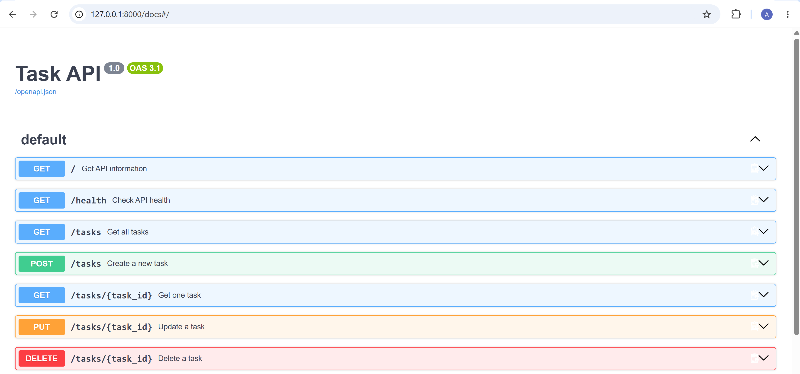
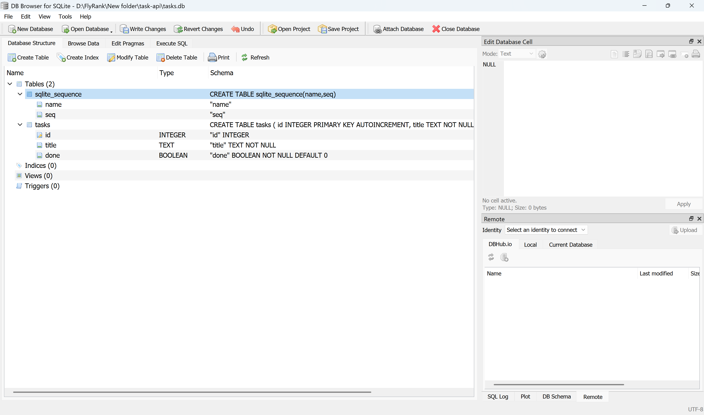

# Task API — SQLite Database

A simple CRUD API built with **FastAPI** and **SQLite**.

This project is an upgraded version of the previous in-memory Task API. Instead of storing tasks in a Python list, tasks are now stored permanently in a SQLite database.

## Why SQLite?

SQLite was chosen because it is lightweight, easy to use, requires no separate database server, and stores the complete database in a single file.

## Database

The database file is:

```text
tasks.db
```

It is automatically created when the application starts.

The `tasks` table contains:

| Column | Type    | Description            |
| ------ | ------- | ---------------------- |
| id     | INTEGER | Primary key            |
| title  | TEXT    | Task title             |
| done   | BOOLEAN | Task completion status |

If the table is empty, three example tasks are automatically inserted.

## How to Run

Create and activate a virtual environment, install the dependencies, and start the server:

```powershell
python -m uvicorn main:app --reload
```

The API will be available at:

```text
http://127.0.0.1:8000
```

Swagger documentation:

```text
http://127.0.0.1:8000/docs
```

## API Endpoints

| Method | Endpoint      | Description         |
| ------ | ------------- | ------------------- |
| GET    | `/`           | Get API information |
| GET    | `/health`     | Check API health    |
| GET    | `/tasks`      | Get all tasks       |
| GET    | `/tasks/{id}` | Get one task        |
| POST   | `/tasks`      | Create a task       |
| PUT    | `/tasks/{id}` | Update a task       |
| DELETE | `/tasks/{id}` | Delete a task       |

## SQLite SQL Query

One of the SQL queries executed during this assignment was:

```sql
SELECT * FROM tasks WHERE done = 1;
```

This query returns all completed tasks.

Other queries tested:

```sql
SELECT * FROM tasks;
```

```sql
SELECT COUNT(*) FROM tasks;
```

```sql
UPDATE tasks SET done = 1;
```

```sql
DELETE FROM tasks WHERE done = 1;
```

## Screenshots

### Swagger UI



### SQLite Database



## Persistence

Tasks are stored in `tasks.db`, so data remains available after the FastAPI server is stopped and restarted.

The database and table are automatically created if they do not already exist.

## Technologies

* Python
* FastAPI
* Uvicorn
* SQLite
* SQL
* Pydantic

## Contact with me:

**LinkedIn:** [linkedin.com/in/adnamuhammadfarooq](https://www.linkedin.com/in/adnamuhammadfarooq)
GitHub: [Adna-Muhammad-Farooq](https://github.com/Adna-Muhammad-Farooq)
**Email:** [shinwariadna@gmail.com](mailto:shinwariadna@gmail.com)
* Email: [adnamuhammadfarooq27@gmail.com](mailto:adnamuhammadfarooq27@gmail.com)
